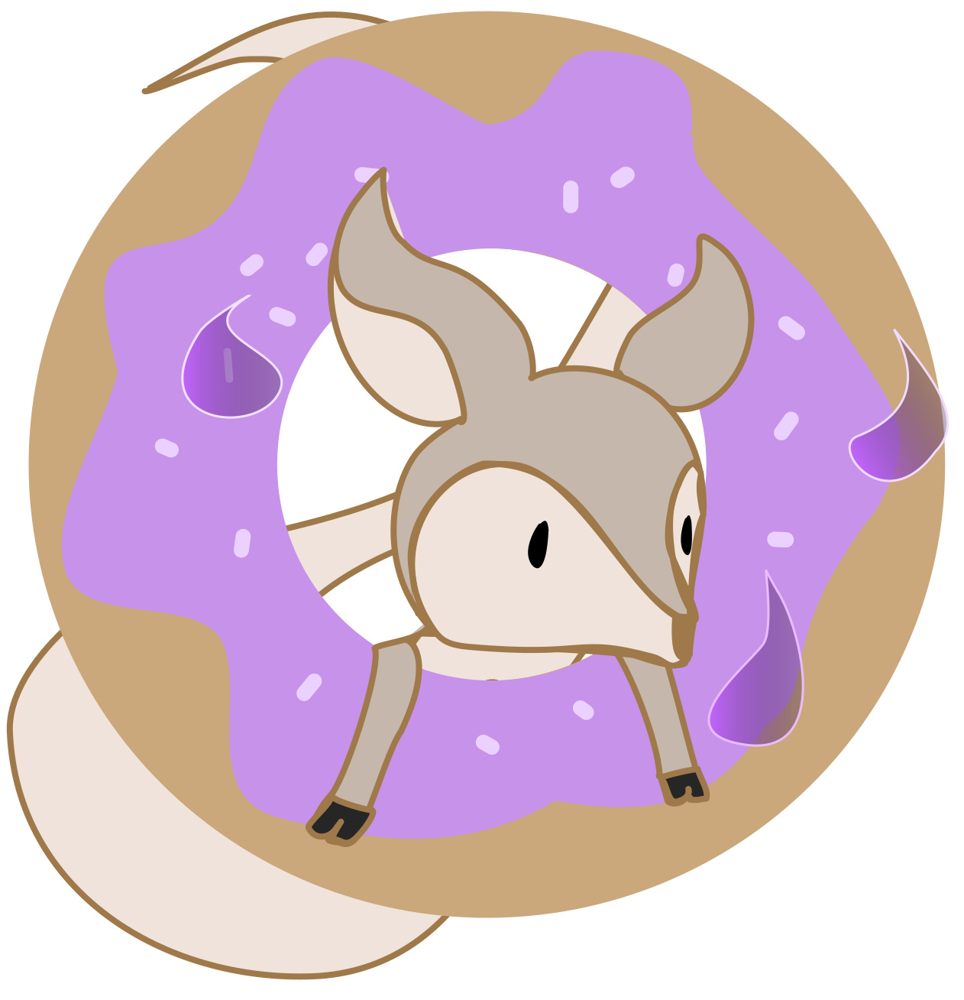

<h1 align="center">Hey, I'm Tom </h1>

## 👤 About me

I'm a young dude studying IT engineering at 📍 TELECOM Nancy, France. I'm mainly interested in full-stack web development, compilers and low-level programming, but I like to do a bit of everything :)

## 💻 Languages and Frameworks

&nbsp;
&nbsp;
&nbsp;
&nbsp;
&nbsp;
&nbsp;
&nbsp;
&nbsp;
&nbsp;

## 🚧 Projects

### FTC : A file finder implemented in C

### Claudle : A Wordle clone made with Flask and ReactJS

## 📊 Stats

